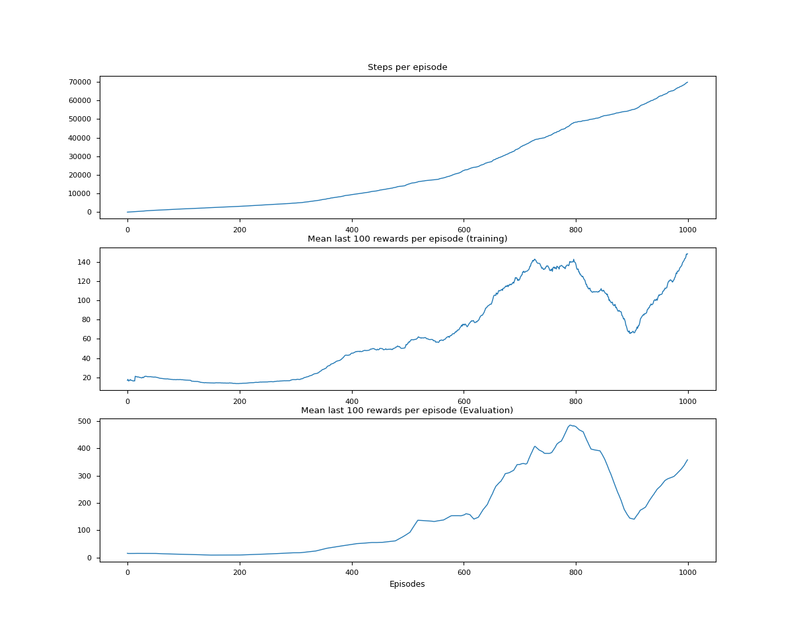

# RL using function approximation

## [Neural Fitted Q iteration](https://ml.informatik.uni-freiburg.de/former/_media/publications/rieecml05.pdf) Result on cartPole V1

### 1st issue with this network: Non-stationarity of the target

FCQ Network with a Q-learning update converge but we got to be careful. In fact this only works because I've set a large batch size, that mean multiple q values will be updated at the same time (generalization across states), so this simulate the fact that our target is stationary during this batch.  
  
This problem of non-stationarity with RL can be solve with DQN by having 2 instances of the same network One that generate experiences (the behavior policy) and another instance that calculate the target (the target policy). The target policy will be fixed, we wont update it during x steps, so its weight wont be up to date. The behavior policy will be. Then after x steps we will copy the weights of the behavior policy into the target policy.  
This will allow to move the behavior policy toward the target while the target remain fixed, then we move the target.  
Not only this allow not chasing our own tail but also we will be able to use smaller batches.

### 2nd issue with this network: Non-stationarity of the target

Because we are collecting experiences then learn directly from them, it is obvious that the experience at t is highly correlated with the one at t+1. This goes again the **Markov Property**. In order to solve this, DQN have a Replay Buffer of size M. We will collect M experience tuple, then sample n experience tuples (n = batch size) from the replay buffer uniformly at random in order to learn from them. This way we ensure that the experiences are not correlated.  

## [DQN Nature](https://web.stanford.edu/class/psych209/Readings/MnihEtAlHassibis15NatureControlDeepRL.pdf) Result on cartPole V1
