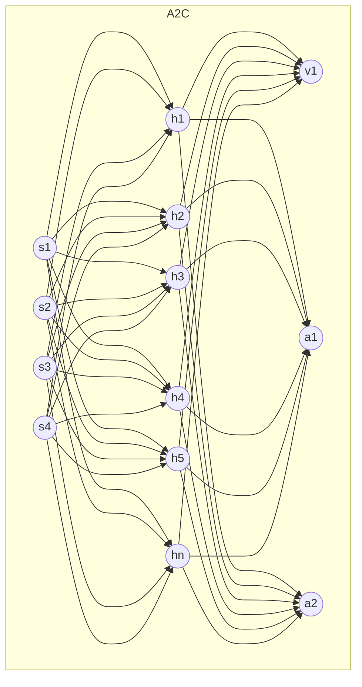
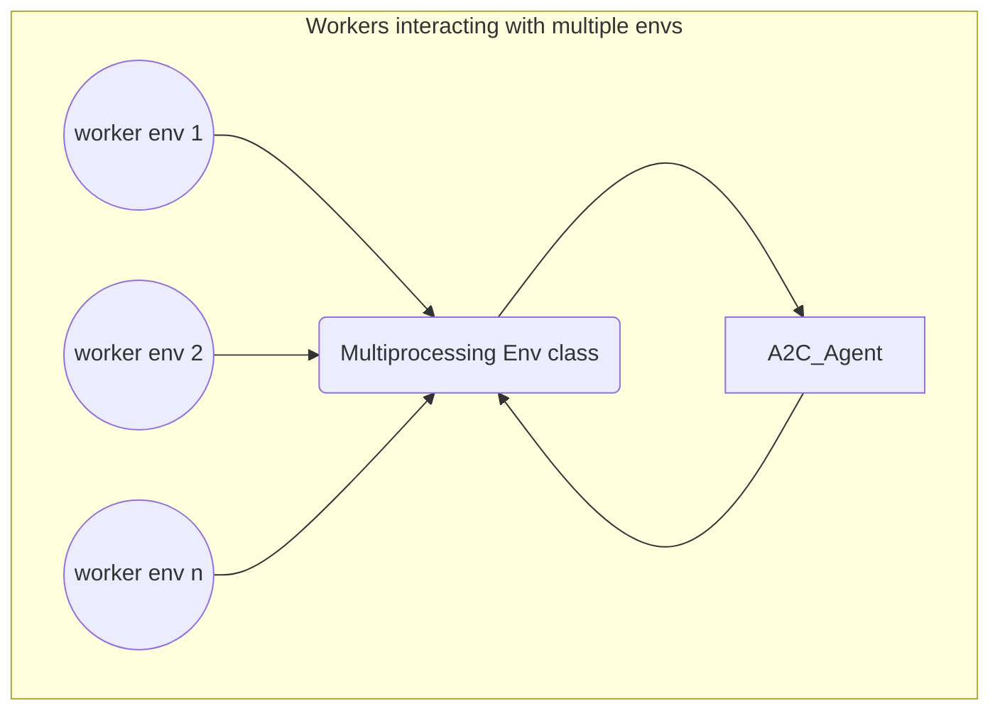

# Policy based methods

Goal is to maximize the true value function of a parameterized policy from all initial states.
So maximize the true value function by changing the policy (without touching the value function).  
  
We want to **find the gradient** which will help reaching this objective

## REINFORCE
<center>Use of function approximation (here a policy network) to generate probabilities over actions</center>  

<style>
    svg[id^="mermaid-"] { width: 100%; max-height: 450px;}
</style>
  ```mermaid

  %%{ init: { 'flowchart': { 'curve': 'basis' } } }%%
graph TD;
    subgraph Policy Network
    id1((s1)) & id2((s2)) & id3((s3)) & id4((s4)) ---> 
    h1((h1)) & h2((h2)) & h3((h3)) & h4((h4)) & h5((h5)) & hn((hn)) ---> a1((a1)) & a2((a2));
end
```
The Policy Network have nS (state size) inputs and nA outputs that represent the distribution over actions.

From a trajectory $\lambda$ and output from the model, we obtain at each step $t$:

#### <center>$G_t(\lambda) * log \pi (A_t | S_t;\theta)$</center>

>- $G_t$ being the discounted return
>- $log \pi (A_t | S_t;\theta)$ is parameterized by $\theta$, so it is the output from the policy network.

So the gradient we are trying to estimate and maximize **(The Objective Function)** is:

#### <center>$\boxed{J(\theta) = \frac{1}{T} \sum_{t=0}^T G_t(\lambda) * log \pi (A_t | S_t;\theta)}$</center>

In PyTorch, since the default behavior of gradient update is gradient descent, we put a negative sign in order to do gradient ascent.  

```python
loss = -(discounts * returns * logpas).mean()
optimizer.zero_grad()
loss.backward()
optimizer.step()
```

As we can see, the return $G_t$ is used to **weight** the log probability of the action taken at time t. That mean if the return is bad at time t, it is because action taken at time t was bad, so by multiplying the bad return with the probability of that action, we reduce the likelihood.
of that action being selected at that step.  

[](
  https://github.com/Mdhvince/reinforcement_learning/blob/master/deep_rl/policy_based_and_ac/reinforce.py
)

***
## Vanilla Policy Gradient or REINFORCE with baseline

<center>Use 2 neural networks (policy network & value network) to respectively give the value of a state and generate probabilities over actions</center>  

  ```mermaid
%%{ init: { 'flowchart': { 'curve': 'basis' } } }%%
graph

subgraph Vanilla Policy Gradient

   subgraph Value Network
        id1((s1)) & id2((s2)) & id3((s3)) & id4((s4)) ---> 
        h1((h1)) & h2((h2)) & h3((h3)) & h4((h4)) & h5((h5)) & hn((hn)) ---> v1((v1))
    end

    subgraph Policy Network
        i1((s1)) & i2((s2)) & i3((s3)) & i4((s4)) ---> 
        hh1((h1)) & hh2((h2)) & hh3((h3)) & hh4((h4)) & hh5((h5)) & hh6((hn)) ---> a1((a1)) & a2((a2))
    end

end


```
- The Value Network have nS (state size) inputs and 1 output that represent the Value of a state.
- The Policy Network have nS (state size) inputs and nA outputs that represent the distribution over actions.

Some issues with REINFORCE:
>- **High variance** because of the accumulation of random event along a trajectory (full monte carlo return is used to calculate the gradient).
>- Log probabilities are changing proportionally to the return : $G_t(\lambda) log \pi (A_t | S_t;  \theta)$ - this can be an issue in environment with only positive rewards, return can be the same, so action probability can be quite similar.

In VPG, we solve the 2nd point: we need a way to differenciate "ok actions" & "best actions".  
For this we use the **Action-Advantage** function estimate $A(S_t, A_t; \phi) = G_t - V(S_t; \phi)$ instead of the return $G_t$ to weight the log probability of actions. 

**$A(S_t, A_t; \phi)$** center scores around 0 such that:
>- Better than average actions will have a positive value
>- Worst than average actions will have a negative value

We also use an **entropy term** $H$ weighted by $\beta$ in order to encourage exploration.  
  
So the gradient we are trying to estimate is:  

#### <center>$\boxed{A(S_t, A_t; \phi) * log \pi (A_t | S_t;  \theta) + \beta H(\pi (S_t;\theta))}$</center>

We can subsitute $A(S_t, A_t; \phi)$ by $G_t - V(S_t; \phi)$ and obtain:

#### <center>$\boxed{(G_t - V(S_t; \phi)) * log \pi (A_t | S_t;  \theta) + \beta H(\pi (S_t;  \theta))}$</center>

Loss for the Policy Network is:  

#### <center>$\boxed{L(\theta) = -\frac{1}{N}  \sum_{n=0}^N [(G_t - V(S_t; \phi)) * log \pi (A_t | S_t;  \theta) + \beta H(\pi (S_t;  \theta))]}$</center>
  
In first term $G_t - V(S_t; \phi)$, the state-value function is parameterized by $\phi$. So we need a value network to return the value of a state. The second and the third term are parameterized by $ \theta$ so we also need a policy network that return action probabilities then deduce the log and the entropy.   
   
Loss for the Value Network is:  
  
#### <center>$\boxed{L(\phi) = \frac{1}{N}  \sum_{n=0}^N [(G_t - V(S_t; \phi))^2]}$</center>
  
So in VPG we need a value network and a policy network. Because VPG is still using a full trajectory, there is no bias in the algorithm, so we assume the algorithm is "right" so cannot be considered as a "critic" (A thought by Rich Sutton. I also share his idea on that, so for me this is not an actor-critic algoritm). 

[](
  https://github.com/Mdhvince/reinforcement_learning/blob/master/deep_rl/policy_based_and_ac/vanilla_policy_gradient.py
)

***
## Advantage Actor-Critic: A2C (Sharing Weight)  

<center>Use of One neural networks to update both the policy & the value network by sharing the weight</center>



<center>Use of multiple workers (multiprocessing) to collect samples of the environment</center>  



VPG works pretty well on simple problem. it uses MC returns $G_t$ to estimate the action-advantage function. There is no bias in VPG.  
Sometime it is good to add a little bit of bias to reduce the variance. AC2 uses several methods to deal with variance.

>- Use n-steps returns with boostrapping and robust GAE to estimate the action-advantage function
>- Use multiple workers to roll out sample in parallel from multiple environments, this decorrelate the gathered data and reduce variance for training (like the replay buffer, but here there is no storage needed)

<center>In VPG, we estimate the action-advantage function as follow</center> 
<br>
<center>$\boxed{A(S_t, A_t; \phi) = G_t - V(S_t; \phi)}$</center> 
<br>
<br>

In A2C, we use an **n-steps** (partial return) version of the action-advantage function instead of the full return  
<center>$\boxed{A(S_t, A_t; \phi) = R_t + \gamma R_{t+1} + ... + \gamma^n R_{t+n} + \gamma^{n+1} V(S_{t+n+1}; \phi) - V(S_t; \phi)}$</center> 
<br>

##### Generalized Advantage estimator (GAE)

Aditionally, we use the **(GAE)**, to make a more robust estimate of the action-advantage function $A^{GAE}$, here is how to construct it  
<br>

>1. Compute the **left hand-side** (partial return or n-steps version) of the action-advantage function:
<center>
    $A(S_t, A_t; \phi) = R_t + \gamma R_{t+1} + ... + \gamma^n R_{t+n} + \gamma^{n+1} V(S_{t+n+1}; \phi)$
</center>  

```python
n_step_returns = []
for w in range(self.n_workers):
    for t_step in range(T):
        discounted_reward = discounts[:T-t_step] * rewards[t_step:, w]
        n_step_returns.append(np.sum(discounted_reward))
```
<br>

We use n-steps but we dont know what is a good value for n,  n > 1 if usually good but:
- if n is too large it will be as the full MC return (more variance, as in VPG)
- if too small it will be to close to the one-step TD update (more biased)

We can use a weighted combination of all n-steps action-advantage target as a single target. That mean, the more n is large, the less impact the action-advantage target will have. We will in fact **discount** the action-advantage target by a exponentially decaying factor $\lambda$.  
<br>

>2. Get the lambda $\lambda$ and apply the discount factor on it
<center>$\sum_{l=0}^\infty (\gamma \lambda)^l$</center> 

```python
lambda_discounts = np.logspace(start=0, stop=T-1, num=T-1, base=self.gamma*self.lambdaa, endpoint=False)
```
<br>
  
>3. Calculate TD errors
<center>$\sum_{t=0}^T R_t * \gamma V(S_{t+1}) - V(S_t)$</center>

```python
td_errors = rewards[:-1] + self.gamma * values[1:] - values[:-1]
```
<br>

>4. Apply the $\lambda$ discounts on the TD errors, hence produce the robust estimator $A^{GAE}$
<center>$A^{GAE} = \sum_{l=0}^\infty (\gamma \lambda)^l * R_t * \gamma V(S_{t+1}) - V(S_t)$</center>

```python
gaes = []
for w in range(self.n_workers):
    for t_step in range(T-1):
        discounted_advantage = lambda_discounts[:T-1-t_step] * td_errors[t_step:, w]
        gaes.append(np.sum(discounted_advantage))
```
<br>

>5. Apply on top, the regular discount on $A^{GAE}$
<center>$\gamma  A^{GAE}$</center>

```python
discounted_gaes = discounts[:-1] * gaes
```
<br>


Loss for the Policy Part is:  
#### <center>$\boxed{L(\theta) = -\frac{1}{N}  \sum_{n=0}^N [\gamma A^{GAE} * log \pi (A_t | S_t;  \theta) + \beta H(\pi (S_t;  \theta))]}$</center>  
<br> 

Loss for the Value Part is:

#### <center>$\boxed{L(\phi) = \frac{1}{N}  \sum_{n=0}^N [(R_t + \gamma R_{t+1} + ... + \gamma^n R_{t+n} + \gamma^{n+1} V(S_{t+n+1}; \phi) - V(S_t; \phi))^2]}$</center>

Since we have one single network sharing the weights, we add the two losses together  
#### <center>$\boxed{L(\theta; \phi) = L(\theta) + L(\phi)}$</center>  

```python
value_error = n_step_returns - values

value_loss = value_error.pow(2).mul(0.5).mean()
policy_loss = -(discounted_gaes.detach() * logpas).mean()
entropy_loss = -entropies.mean()

loss = (policy_loss_weight * policy_loss) +  (value_loss_weight * value_loss) +  (entropy_loss_weight * entropy_loss )    
```
[](
    https://github.com/Mdhvince/reinforcement_learning/blob/master/deep_rl/policy_based_and_ac/a2c.py
)

Next, I will tackle  advanced Actor-Critic methods: DDPG, TD3, SAC, PPO.